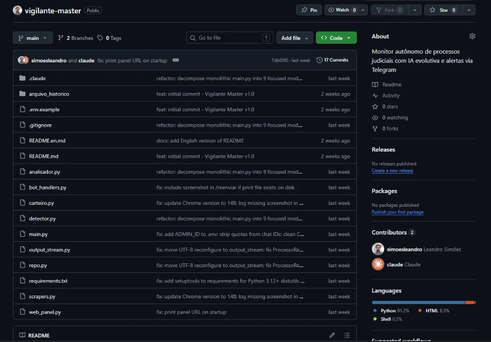

<div align="center">



<br/>

# Vigilante Master

**PT:** Monitor autônomo de processos judiciais — TJRJ, STF e TSE — com IA evolutiva, resumos automáticos e alertas via Telegram.  
**EN:** Autonomous judicial process monitor — TJRJ, STF and TSE — with evolutionary AI, automatic summaries and Telegram alerts.

<br/>

[](https://python.org)
[](https://playwright.dev)
[](https://selenium.dev)
[](https://aistudio.google.com)
[](https://core.telegram.org/bots)
[](https://sqlite.org)
[](LICENSE)
[](https://github.com/simoesleandro/vigilante-master/commits)

<br/>

[🐛 Reportar bug](https://github.com/simoesleandro/vigilante-master/issues) &nbsp;·&nbsp;
[💡 Sugerir feature](https://github.com/simoesleandro/vigilante-master/issues)

</div>

---

## 📋 Índice / Table of Contents

- [Sobre](#-sobre--about)
- [Funcionalidades](#-funcionalidades--features)
- [Tribunais monitorados](#️-tribunais-monitorados--monitored-courts)
- [Stack](#-stack)
- [Arquitetura](#-arquitetura--architecture)
- [Instalação](#-instalação--setup)
- [Variáveis de Ambiente](#-variáveis-de-ambiente--environment-variables)
- [Roadmap](#-roadmap)
- [Autor](#-autor--author)

---

## 📌 Sobre / About

**PT:**  
Vigilante Master monitora processos judiciais nos principais tribunais brasileiros de forma autônoma. Usa Playwright e Selenium Stealth para scraping das páginas processuais, Gemini para gerar resumos evolutivos dos andamentos e Telegram Bot para notificações em tempo real quando há novos movimentos. Arquitetura modular com 9 módulos especializados.

**EN:**  
Vigilante Master autonomously monitors judicial processes in Brazil's major courts. Uses Playwright and Selenium Stealth for scraping procedural pages, Gemini to generate evolutionary summaries of case updates and Telegram Bot for real-time notifications when new movements occur. Modular architecture with 9 specialized modules.

---

## ✨ Funcionalidades / Features

- ✅ **Monitoramento autônomo** — ciclos automáticos de verificação por processo
- ✅ **Multi-tribunal** — TJRJ, STF e TSE em um único sistema
- ✅ **Scraping anti-detecção** — Playwright + Selenium Stealth para sites com proteção
- ✅ **Resumos com IA** — Gemini gera resumos evolutivos dos andamentos processuais
- ✅ **Alertas Telegram** — notificação imediata de novos movimentos
- ✅ **Screenshots automáticos** — captura visual de cada movimentação detectada
- ✅ **Histórico persistente** — SQLite com todos os andamentos e resumos
- ✅ **Web panel** — painel web para acompanhamento dos processos monitorados
- ✅ **Arquitetura modular** — 9 módulos independentes e testáveis

---

## ⚖️ Tribunais monitorados / Monitored Courts

| Tribunal | Cobertura |
|----------|-----------|
| **TJRJ** | Tribunal de Justiça do Estado do Rio de Janeiro |
| **STF** | Supremo Tribunal Federal |
| **TSE** | Tribunal Superior Eleitoral |

---

## 🛠 Stack

| Camada | Tecnologia |
|--------|------------|
| Backend | Python 3.11+ |
| Scraping | Playwright · Selenium Stealth |
| IA | Gemini 2.5 Flash (resumos evolutivos) |
| Notificações | Telegram Bot API |
| Banco | SQLite |
| Web Panel | Flask + HTML/CSS |
| Automação | Loop autônomo com intervalos configuráveis |

---

## 🏗 Arquitetura / Architecture

```
vigilante-master/
├── main.py                # Entry point — loop principal
├── detector.py            # Detecção de novos andamentos
├── analisador.py          # Análise e resumo com Gemini
├── scrapers.py            # Scraping TJRJ / STF / TSE
├── carteiro.py            # Envio de alertas Telegram
├── repo.py                # Persistência SQLite
├── bot_handlers.py        # Handlers do bot Telegram
├── output_stream.py       # Stream de saída unificado
├── web_panel.py           # Painel web Flask
└── arquivo_historico/     # Versões anteriores arquivadas
```

**Fluxo principal:**

```
Loop autônomo (intervalo configurável)
      ↓
scrapers.py — acessa tribunal via Playwright/Selenium
      ↓
detector.py — compara andamentos com histórico SQLite
      ↓
analisador.py — Gemini gera resumo evolutivo
      ↓
carteiro.py — envia alerta Telegram + screenshot
      ↓
repo.py — persiste andamento no banco
```

---

## 🚀 Instalação / Setup

### Pré-requisitos / Prerequisites

- Python 3.12+
- Playwright instalado — `playwright install chromium`
- Chave Gemini (gratuita em [aistudio.google.com](https://aistudio.google.com))
- Bot Telegram configurado

### Instalação / Installation

```bash
# Clone o repositório
git clone https://github.com/simoesleandro/vigilante-master
cd vigilante-master

# Instale as dependências
pip install -r requirements.txt
playwright install chromium

# Configure as variáveis de ambiente
cp .env.example .env
# Edite .env com suas chaves e números de processo

# Rode o monitor
python main.py
```

---

## 🔐 Variáveis de Ambiente / Environment Variables

| Variável | Descrição |
|----------|-----------|
| `GEMINI_API_KEY` | Gemini API (resumos evolutivos) |
| `TELEGRAM_BOT_TOKEN` | Bot Telegram (alertas) |
| `TELEGRAM_CHAT_ID` | Chat ID destino |
| `ADMIN_ID` | ID do administrador do bot |
| `PROCESSOS_TJRJ` | Números de processo TJRJ (separados por vírgula) |
| `PROCESSOS_STF` | Números de processo STF |
| `PROCESSOS_TSE` | Números de processo TSE |
| `INTERVALO_MINUTOS` | Intervalo entre ciclos de verificação |

> Lista completa em: [`.env.example`](.env.example)

---

## 🗺 Roadmap

- [x] Monitoramento TJRJ, STF e TSE
- [x] Scraping com Playwright + Selenium Stealth
- [x] Resumos evolutivos com Gemini
- [x] Alertas Telegram com screenshots
- [x] Arquitetura modular (9 módulos)
- [x] Web panel para acompanhamento
- [ ] Suporte a novos tribunais (TRF, TRT)
- [ ] Interface web completa de gestão
- [ ] Relatório mensal por processo
- [ ] Deploy como serviço Windows (WinSW)

---

## 👤 Autor / Author

<div align="center">

**Leandro Simões**

[](https://linkedin.com/in/leandro-sim%C3%B5es-7a0b3537b)
[](https://github.com/simoesleandro)
[](https://simoesleandro.github.io/portfolio)

*Fullstack · IA Aplicada · Civic Tech*

</div>

---

<div align="center">

Feito com ☕ e IA em / Made with ☕ and AI in 🇧🇷 Rio de Janeiro

</div>
